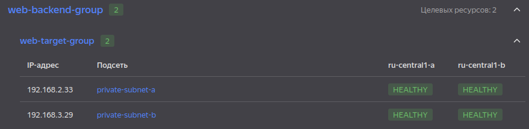
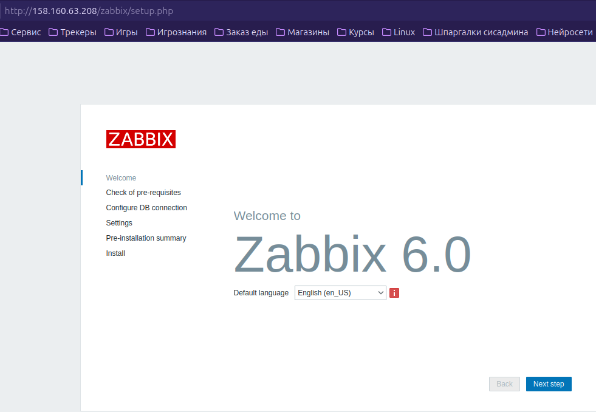
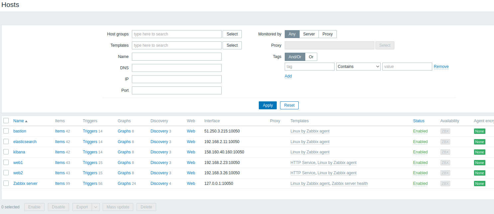
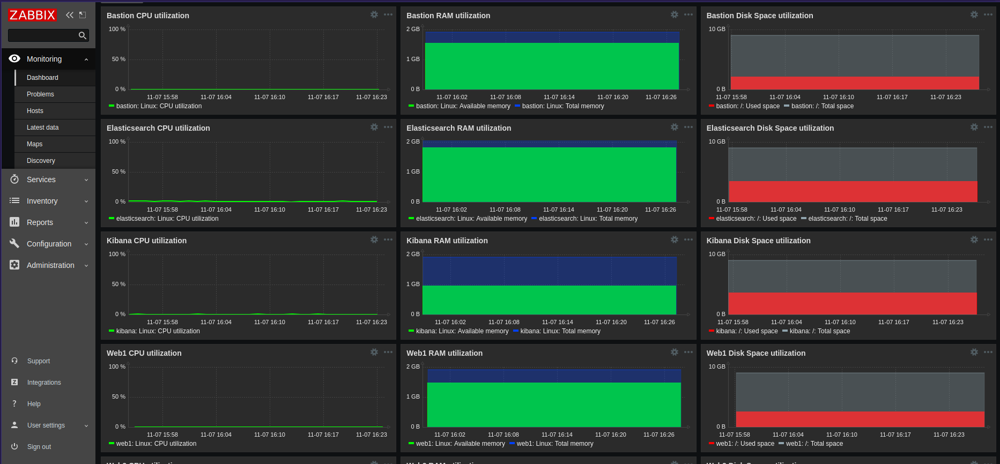
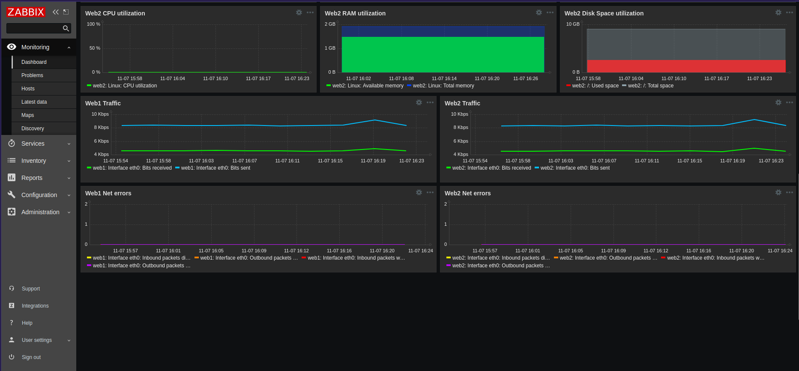
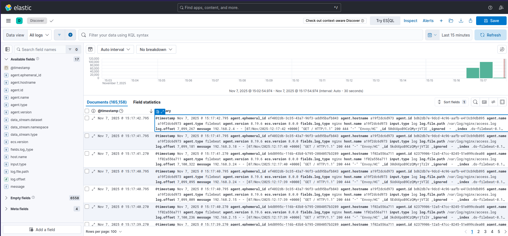
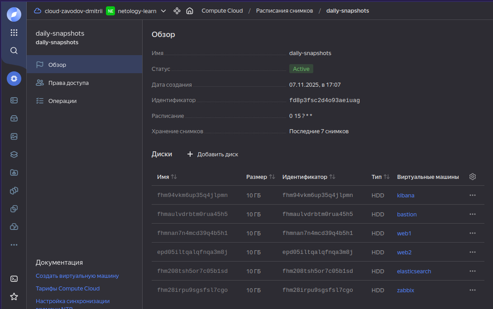
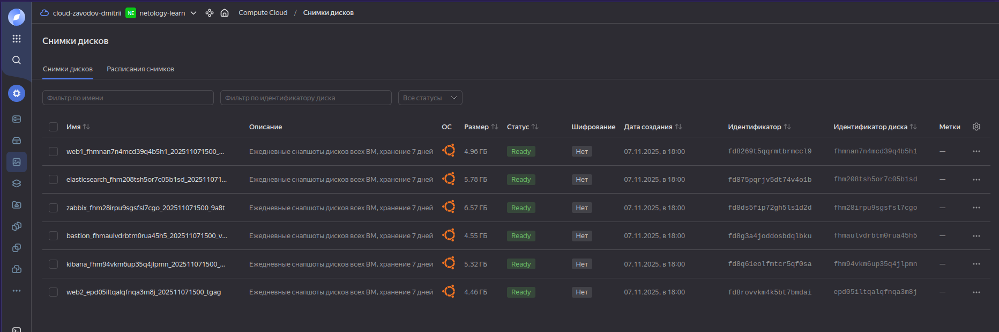

# Дипломный проект: Отказоустойчивая инфраструктура для сайта в Yandex Cloud

## Описание проекта
Данный дипломный проект направлен на создание отказоустойчивой инфраструктуры для статичного сайта, размещённого в Yandex Cloud.
Инфраструктура включает:
- Веб-серверы (Nginx) в разных зонах, без внешних IP, с доступом через Application Load Balancer.
- Мониторинг с помощью Zabbix (метрики: CPU, RAM, диск, сеть, HTTP).
- Сбор логов через Filebeat в Elasticsearch, визуализация в Kibana.
- Резервное копирование дисков (ежедневные snapshots, TTL 7 дней).
- Сеть: VPC с публичной и приватными подсетями, bastion host, NAT-шлюз.

Инфраструктура разворачивается с помощью **Terraform** и **Ansible**. Все ВМ используют минимальные конфигурации (2 ядра 20% Intel Ice Lake, 2-4 ГБ RAM, 10 ГБ HDD, прерываемые на этапе разработки).

---
Работа разбита на этапы для простоты повторения (в случае необходимости) и документирования.

<details>

<summary> Этап 1. Подготовка </summary>

На данном этапе проводится подготовка к развертыванию инфраструктуры.
1. **Настроен аккаунт Yandex Cloud**:
  - Создан сервисный аккаунт с ролью `editor`.
  - Сгенерирован ключ для Terraform (хранится локально, не в Git).
  - Установлен и протестирован Yandex Cloud CLI (`yc init`, `yc compute instance list`).
2. **Установлены инструменты**:
  - Terraform (1.13.4-1) для управления инфраструктурой:
```bash
sudo apt update && sudo apt install -y gnupg software-properties-common
sudo mkdir -p /etc/apt/keyrings
curl -fsSL https://apt.releases.hashicorp.com/gpg | sudo gpg --dearmor -o /etc/apt/keyrings/hashicorp-archive-keyring.gpg
echo "deb [signed-by=/etc/apt/keyrings/hashicorp-archive-keyring.gpg] https://apt.releases.hashicorp.com $(lsb_release -cs) main" | sudo tee /etc/apt/sources.list.d/hashicorp.list
sudo apt update
sudo apt install terraform -y
terraform -v
```
  - Ansible (2.16.3) для конфигурации ВМ:
```bash
sudo apt update
sudo apt install ansible -y
ansible --version
```
  - Docker (28.5.1) для локального тестирования ELK Stack; после установки необходимо перелогиниться для применения группы docker:
```bash
sudo apt update
sudo apt install ca-certificates curl
sudo install -m 0755 -d /etc/apt/keyrings
sudo curl -fsSL https://download.docker.com/linux/ubuntu/gpg -o /etc/apt/keyrings/docker.asc
sudo chmod a+r /etc/apt/keyrings/docker.asc
echo \
"deb [arch=$(dpkg --print-architecture) signed-by=/etc/apt/keyrings/docker.asc] https://download.docker.com/linux/ubuntu \
$(. /etc/os-release && echo "${UBUNTU_CODENAME:-$VERSION_CODENAME}") stable" | \
sudo tee /etc/apt/sources.list.d/docker.list > /dev/null
sudo apt update
sudo apt install docker-ce docker-ce-cli containerd.io docker-buildx-plugin docker-compose-plugin
sudo groupadd docker
sudo usermod -aG docker $USER
```
  - Git (2.43.0)
```bash
sudo apt install git -y
git --version
```
3. **Создан SSH-ключ**:
  - Сгенерирован ключ `rsa` (`~/.ssh/id_rsa.pub`) для доступа к ВМ.
```bash
ssh-keygen -t rsa -b 4096 -f ~/.ssh/id_rsa
```
4. **Настроено безопасное хранение секретов**:
  - Создан файл ~/.yc/key.json, хранящий ключ Yandex Cloud, файл добавлен в CLI:
```bash
yc config set service-account-key ~/.yc/key.json
```
5. **Настроены переменные окружения для Terraform**:
  - Получены значения переменных:
```bash
yc iam create-token
yc config get cloud-id
yc config get folder-id
```
  - Переменные добавлены в ~/.bashrc:
```bash
export YC_TOKEN="your-token-here"
export YC_CLOUD_ID="your-cloud-id-here"
export YC_FOLDER_ID="your-folder-id-here"
```
1. **Проведено первичное тестирование**
  - Доступ к Yandex Cloud:
```bash
yc compute instance list
```
Вывод:
```
+----+------+---------+--------+-------------+-------------+
| ID | NAME | ZONE ID | STATUS | EXTERNAL IP | INTERNAL IP |
+----+------+---------+--------+-------------+-------------+
+----+------+---------+--------+-------------+-------------+
```
  - Работа Terraform:
```bash
terraform init
```
Вывод:
```
Terraform initialized in an empty directory!

The directory has no Terraform configuration files. You may begin working
with Terraform immediately by creating Terraform configuration files.
```
  - Работа Ansible:
```bash
ansible localhost -m ping
```
Вывод:
```
[WARNING]: No inventory was parsed, only implicit localhost is available
localhost | SUCCESS => {
  "changed": false,
  "ping": "pong"
}
```
  - Работа Docker:
```bash
yc iam create-token
yc config get cloud-id
yc config get folder-id
```
Вывод:
```
Unable to find image 'hello-world:latest' locally
latest: Pulling from library/hello-world
17eec7bbc9d7: Pull complete 
Digest: sha256:56433a6be3fda188089fb548eae3d91df3ed0d6589f7c2656121b911198df065
Status: Downloaded newer image for hello-world:latest

Hello from Docker!
This message shows that your installation appears to be working correctly.

 To generate this message, Docker took the following steps:
 1. The Docker client contacted the Docker daemon.
 2. The Docker daemon pulled the "hello-world" image from the Docker Hub.
    (amd64)
 3. The Docker daemon created a new container from that image which runs the
    executable that produces the output you are currently reading.
 4. The Docker daemon streamed that output to the Docker client, which sent it
    to your terminal.

To try something more ambitious, you can run an Ubuntu container with:
 $ docker run -it ubuntu bash

Share images, automate workflows, and more with a free Docker ID:
 https://hub.docker.com/

For more examples and ideas, visit:
 https://docs.docker.com/get-started/
```

</details>

<details>

<summary> Этап 2: Настройка сети и групп безопасности </summary>

На данном этапе проводится настройка провайдера, развёртывыние сетей, Security Groups и NAT.
1. **Фиксируем версии и настраиваем провайдера**
  - versions.tf:
```hcl
terraform {
  required_version = ">= 1.13.0"

  required_providers {
    yandex = {
      source  = "yandex-cloud/yandex"
      version = ">= 0.168.0"
    }
  }
}
```
  - providers.tf:
```hcl
provider "yandex" {
  service_account_key_file = pathexpand("~/.yc/key.json") # Авторизованный ключ
  cloud_id  = var.yc_cloud_id
  folder_id = var.yc_folder_id
  zone      = "ru-central1-a"
}
```
  - terraform.tfvars (добавить валидные значения):
```bash
yc_cloud_id  = "..."
yc_folder_id = "..."
my_ip        = "..."
```
2. **Определяем переменные**:
  - variables.tf:

```hcl
variable "yc_cloud_id" {
  description = "Yandex Cloud ID"
  type        = string
}

variable "yc_folder_id" {
  description = "Yandex Folder ID"
  type        = string
}

variable "vpc_name" {
  description = "Name of the VPC"
  type        = string
  default     = "diploma-vpc"
}

variable "my_ip" {
  description = "My public IP for SSH access"
  type        = string
  sensitive   = true
}

variable "public_subnet_cidr" {
  description = "CIDR for public subnet"
  type        = string
  default     = "192.168.1.0/24"
}

variable "private_subnet_a_cidr" {
  description = "CIDR for private subnet in zone a"
  type        = string
  default     = "192.168.2.0/24"
}

variable "private_subnet_b_cidr" {
  description = "CIDR for private subnet in zone b"
  type        = string
  default     = "192.168.3.0/24"
}
```
3. **Настраиваем VPC и подсети**
  - networks.tf:
```hcl
# VPC
resource "yandex_vpc_network" "diploma" {
  name = var.vpc_name
}

# Публичная подсеть (для Zabbix, Kibana, Bastion, ALB)
resource "yandex_vpc_subnet" "public" {
  name           = "public-subnet"
  zone           = "ru-central1-a"
  network_id     = yandex_vpc_network.diploma.id
  v4_cidr_blocks = [var.public_subnet_cidr]
}

# Приватные подсети
resource "yandex_vpc_subnet" "private_a" {
  name           = "private-subnet-a"
  zone           = "ru-central1-a"
  network_id     = yandex_vpc_network.diploma.id
  v4_cidr_blocks = [var.private_subnet_a_cidr]
  route_table_id = yandex_vpc_route_table.nat.id
}

resource "yandex_vpc_subnet" "private_b" {
  name           = "private-subnet-b"
  zone           = "ru-central1-b"
  network_id     = yandex_vpc_network.diploma.id
  v4_cidr_blocks = [var.private_subnet_b_cidr]
  route_table_id = yandex_vpc_route_table.nat.id
}
```
4. **Настраиваем NAT-шлюз и таблицу маршрутов**
  - nat.tf:
```hcl
# NAT-шлюз (управляется Yandex'ом)
resource "yandex_vpc_gateway" "nat_gateway" {
  name = "nat-gateway"
  shared_egress_gateway {}
}

# Маршрутная таблица
resource "yandex_vpc_route_table" "nat" {
  name       = "private-rt"
  network_id = yandex_vpc_network.diploma.id

  static_route {
    destination_prefix = "0.0.0.0/0"
    gateway_id         = yandex_vpc_gateway.nat_gateway.id
  }
}
```
5. **Настраиваем Security Groups**
  - security-groups.tf:
```hcl
# Бастион-хост: только SSH
resource "yandex_vpc_security_group" "bastion" {
  name       = "bastion-sg"
  network_id = yandex_vpc_network.diploma.id

  ingress {
    protocol       = "tcp"
    description    = "SSH"
    v4_cidr_blocks = [var.my_ip] # Переменная хранится в terraform.tfvars
    port           = 22
  }

  egress {
    protocol       = "any"
    description    = "All outbound"
    v4_cidr_blocks = ["0.0.0.0/0"]
  }
}

# Веб-серверы
resource "yandex_vpc_security_group" "web" {
  name       = "web-sg"
  network_id = yandex_vpc_network.diploma.id

  ingress {
    protocol          = "any"
    description       = "HTTP from ALB"
    security_group_id = yandex_vpc_security_group.alb.id
    port              = 80
  }

  ingress {
    protocol          = "tcp"
    description       = "SSH from bastion"
    security_group_id = yandex_vpc_security_group.bastion.id
    port              = 22
  }

  ingress {
    protocol          = "tcp"
    description       = "Zabbix Agent"
    security_group_id = yandex_vpc_security_group.zabbix.id
    port              = 10050
  }

  ingress {
    protocol       = "any"
    from_port      = 0
    to_port        = 65535
    v4_cidr_blocks = ["0.0.0.0/0"]
  }

  egress {
    protocol       = "any"
    v4_cidr_blocks = ["0.0.0.0/0"]
  }
}

# Zabbix
resource "yandex_vpc_security_group" "zabbix" {
  name       = "zabbix-sg"
  network_id = yandex_vpc_network.diploma.id

  ingress {
    protocol       = "tcp"
    description    = "Zabbix Server from agents"
    v4_cidr_blocks = [
      var.private_subnet_a_cidr,
      var.private_subnet_b_cidr
    ]
    port           = 10051
  }

  ingress {
    protocol       = "tcp"
    description    = "Web UI"
    v4_cidr_blocks = ["0.0.0.0/0"]
    port           = 80
  }

  egress {
    protocol       = "any"
    v4_cidr_blocks = ["0.0.0.0/0"]
  }
}

# Elasticsearch
resource "yandex_vpc_security_group" "elasticsearch" {
  name       = "elasticsearch-sg"
  network_id = yandex_vpc_network.diploma.id

  ingress {
    protocol          = "tcp"
    description       = "From Kibana"
    security_group_id = yandex_vpc_security_group.kibana.id
    port              = 9200
  }

  ingress {
    protocol          = "tcp"
    description       = "From Filebeat"
    security_group_id = yandex_vpc_security_group.web.id
    port              = 9200
  }

  egress {
    protocol       = "any"
    v4_cidr_blocks = ["0.0.0.0/0"]
  }
}

# Kibana
resource "yandex_vpc_security_group" "kibana" {
  name       = "kibana-sg"
  network_id = yandex_vpc_network.diploma.id

  ingress {
    protocol       = "tcp"
    description    = "Kibana UI"
    v4_cidr_blocks = ["0.0.0.0/0"]
    port           = 5601
  }

  egress {
    protocol       = "any"
    v4_cidr_blocks = ["0.0.0.0/0"]
  }
}

# ALB
resource "yandex_vpc_security_group" "alb" {
  name       = "alb-sg"
  network_id = yandex_vpc_network.diploma.id

  ingress {
    protocol       = "any"
    description    = "HTTP"
    v4_cidr_blocks = ["0.0.0.0/0"]
    port           = 80
  }

  ingress {
    protocol          = "any"
    description       = "ALB Health Checks"
    predefined_target = "loadbalancer_healthchecks"
  }

  egress {
    protocol       = "any"
    v4_cidr_blocks = ["0.0.0.0/0"]
  }
}
```
6. **Определяем выходные переменные**
  - outputs.tf:
```hcl
output "vpc_id" {
  value = yandex_vpc_network.diploma.id
}

output "public_subnet_id" {
  value = yandex_vpc_subnet.public.id
}

output "private_subnet_a_id" {
  value = yandex_vpc_subnet.private_a.id
}

output "private_subnet_b_id" {
  value = yandex_vpc_subnet.private_b.id
}
```
7. **Обновляем .gitignore**
  - .gitignore
```gitignore
# Terraform
.terraform/
.terraform.lock.hcl
terraform.tfstate
terraform.tfstate.backup
terraform.tfvars

# Secrets
*.pem
*.key
*.json

# Локальные файлы
*.log
*.tmp
```
8. **Деплой и тестирование**
  - Инициализация, планирование и деплой:
```bash
terraform init
terraform fmt
terraform validate
terraform plan
terraform apply
```
Вывод:
```bash
Apply complete! Resources: 4 added, 0 changed, 0 destroyed.

Outputs:

private_subnet_a_id = "e9barqde95t2rcjf8uat"
private_subnet_b_id = "e2l2sebcm20e81l21k7f"
public_subnet_id = "e9blrcb6v4jh4ueup7es"
vpc_id = "enpm1n1vj6mnoir9s07g"
```
  - Проверка VPC и подсетей:
```bash
yc vpc network list
yc vpc subnet list
```
Вывод:
```
+----------------------+-------------+
|          ID          |    NAME     |
+----------------------+-------------+
| enpm1n1vj6mnoir9s07g | diploma-vpc |
+----------------------+-------------+

+----------------------+------------------+----------------------+----------------------+---------------+------------------+
|          ID          |       NAME       |      NETWORK ID      |    ROUTE TABLE ID    |     ZONE      |      RANGE       |
+----------------------+------------------+----------------------+----------------------+---------------+------------------+
| e2l2sebcm20e81l21k7f | private-subnet-b | enpm1n1vj6mnoir9s07g | enp4qmo8v4utndon8p24 | ru-central1-b | [192.168.3.0/24] |
| e9barqde95t2rcjf8uat | private-subnet-a | enpm1n1vj6mnoir9s07g | enp4qmo8v4utndon8p24 | ru-central1-a | [192.168.2.0/24] |
| e9blrcb6v4jh4ueup7es | public-subnet    | enpm1n1vj6mnoir9s07g |                      | ru-central1-a | [192.168.1.0/24] |
+----------------------+------------------+----------------------+----------------------+---------------+------------------+
```
  - Проверка маршрутной таблицы NAT:
```bash
yc vpc route-table list
yc vpc route-table get private-rt
```
Вывод:
```
+----------------------+------------+-------------+----------------------+
|          ID          |    NAME    | DESCRIPTION |      NETWORK-ID      |
+----------------------+------------+-------------+----------------------+
| enptd2905th1oar8br6c | private-rt |             | enpjcf9clf2hj4de6kcm |
+----------------------+------------+-------------+----------------------+

id: enptd2905th1oar8br6c
folder_id: b1gh19tdmqdb1m0tod0r
created_at: "2025-11-02T12:22:26Z"
name: private-rt
network_id: enpjcf9clf2hj4de6kcm
static_routes:
  - destination_prefix: 0.0.0.0/0
    gateway_id: enpkq1ilbv8tf5j9k0sb
```
  - Проверка Security Groups:
```bash
yc vpc security-group list
```
Вывод:
```
+----------------------+---------------------------------+--------------------------------+----------------------+
|          ID          |              NAME               |          DESCRIPTION           |      NETWORK-ID      |
+----------------------+---------------------------------+--------------------------------+----------------------+
| enp618o0ajocjd9schrj | zabbix-sg                       |                                | enpm1n1vj6mnoir9s07g |
| enp7pm0aca0g0aij2mbs | default-sg-enpm1n1vj6mnoir9s07g | Default security group for     | enpm1n1vj6mnoir9s07g |
|                      |                                 | network                        |                      |
| enpb4o34q30h2e2s91he | web-sg                          |                                | enpm1n1vj6mnoir9s07g |
| enpdkuonccdqsn7h3i3q | elasticsearch-sg                |                                | enpm1n1vj6mnoir9s07g |
| enphj4jrom4982j7tqko | bastion-sg                      |                                | enpm1n1vj6mnoir9s07g |
| enpldnhd3l1oi4ngae7v | alb-sg                          |                                | enpm1n1vj6mnoir9s07g |
| enpp5sain0s62q7hdju1 | kibana-sg                       |                                | enpm1n1vj6mnoir9s07g |
+----------------------+---------------------------------+--------------------------------+----------------------+
```

</details>

<details>

<summary> Этап 3: Развертывание виртуальных машин </summary>

На данном этапе проводится развёртывание и настройка виртуальных машин и назначение им сетевых расположений, созданных ранее.
1. **Определяем параметры виртуальных машин**
  - instances.tf:
```hcl
# Образ
data "yandex_compute_image" "ubuntu" {
  family = "ubuntu-2204-lts"
}

# Bastion
resource "yandex_compute_instance" "bastion" {
  name        = "bastion"
  hostname    = "bastion"
  platform_id = "standard-v3"
  zone        = "ru-central1-a"

  resources {
    cores         = 2
    memory        = 2
    core_fraction = 20
  }

  boot_disk {
    initialize_params {
      image_id = data.yandex_compute_image.ubuntu.id
      size     = 10
    }
  }

  network_interface {
    subnet_id          = yandex_vpc_subnet.public.id
    nat                = true
    security_group_ids = [yandex_vpc_security_group.bastion.id]
  }

  metadata = {
    ssh-keys = "ubuntu:${file("~/.ssh/id_rsa.pub")}"
  }

  scheduling_policy {
    preemptible = true
  }

  allow_stopping_for_update = true
}

# Web-серверы
resource "yandex_compute_instance" "web" {
  for_each = {
    "web1" = { zone = "ru-central1-a", subnet = yandex_vpc_subnet.private_a.id }
    "web2" = { zone = "ru-central1-b", subnet = yandex_vpc_subnet.private_b.id }
  }

  name        = each.key
  hostname    = each.key
  platform_id = "standard-v3"
  zone        = each.value.zone

  resources {
    cores         = 2
    memory        = 2
    core_fraction = 20
  }

  boot_disk {
    initialize_params {
      image_id = data.yandex_compute_image.ubuntu.id
      size     = 10
    }
  }

  network_interface {
    subnet_id          = each.value.subnet
    security_group_ids = [yandex_vpc_security_group.web.id]
  }

  metadata = {
    ssh-keys = "ubuntu:${file("~/.ssh/id_rsa.pub")}"
  }

  scheduling_policy {
    preemptible = true
  }

  allow_stopping_for_update = true
}

# Zabbix
resource "yandex_compute_instance" "zabbix" {
  name        = "zabbix"
  hostname    = "zabbix"
  platform_id = "standard-v3"
  zone        = "ru-central1-a"

  resources {
    cores         = 2
    memory        = 4
    core_fraction = 20
  }

  boot_disk {
    initialize_params {
      image_id = data.yandex_compute_image.ubuntu.id
      size     = 10
    }
  }

  network_interface {
    subnet_id          = yandex_vpc_subnet.public.id
    nat                = true
    security_group_ids = [yandex_vpc_security_group.zabbix.id]
  }

  metadata = {
    ssh-keys = "ubuntu:${file("~/.ssh/id_rsa.pub")}"
  }

  scheduling_policy {
    preemptible = true
  }

  allow_stopping_for_update = true
}

# Elasticsearch
resource "yandex_compute_instance" "elasticsearch" {
  name        = "elasticsearch"
  hostname    = "elasticsearch"
  platform_id = "standard-v3"
  zone        = "ru-central1-a"

  resources {
    cores         = 2
    memory        = 4
    core_fraction = 20
  }

  boot_disk {
    initialize_params {
      image_id = data.yandex_compute_image.ubuntu.id
      size     = 10
    }
  }

  network_interface {
    subnet_id          = yandex_vpc_subnet.private_a.id
    security_group_ids = [yandex_vpc_security_group.elasticsearch.id]
  }

  metadata = {
    ssh-keys = "ubuntu:${file("~/.ssh/id_rsa.pub")}"
  }

  scheduling_policy {
    preemptible = true
  }

  allow_stopping_for_update = true
}

# Kibana
resource "yandex_compute_instance" "kibana" {
  name        = "kibana"
  hostname    = "kibana"
  platform_id = "standard-v3"
  zone        = "ru-central1-a"

  resources {
    cores         = 2
    memory        = 2
    core_fraction = 20
  }

  boot_disk {
    initialize_params {
      image_id = data.yandex_compute_image.ubuntu.id
      size     = 10
    }
  }

  network_interface {
    subnet_id          = yandex_vpc_subnet.public.id
    nat                = true
    security_group_ids = [yandex_vpc_security_group.kibana.id]
  }

  metadata = {
    ssh-keys = "ubuntu:${file("~/.ssh/id_rsa.pub")}"
  }

  scheduling_policy {
    preemptible = true
  }

  allow_stopping_for_update = true
}
```
2. **Добавление выходных переменных**
  - outputs.tf (добавлено):
```hcl
output "bastion_ip" {
  value       = yandex_compute_instance.bastion.network_interface.0.nat_ip_address
  description = "Public IP of bastion host"
}

output "web1_ip" {
  value = yandex_compute_instance.web["web1"].network_interface.0.ip_address
}

output "web2_ip" {
  value = yandex_compute_instance.web["web2"].network_interface.0.ip_address
}

output "elasticsearch_ip" {
  value = yandex_compute_instance.elasticsearch.network_interface.0.ip_address
}
```
3. **Скрипт для локального тестирования и упрощения доступа к Bastion и другим ресурсам по ssh**
  - bastion-config.sh:
```bash
#!/bin/bash

BASTION_IP=$(terraform output -raw bastion_ip)
WEB1_IP=$(terraform output -raw web1_ip)
WEB2_IP=$(terraform output -raw web2_ip)
ELASTIC_IP=$(terraform output -raw elasticsearch_ip)

cat > ~/.ssh/config << EOF
Host bastion
    HostName $BASTION_IP
    User ubuntu
    Port 22
    IdentityFile ~/.ssh/id_rsa
    StrictHostKeyChecking no

Host web1
    HostName $WEB1_IP
    User ubuntu
    ProxyJump bastion
    IdentityFile ~/.ssh/id_rsa
    StrictHostKeyChecking no

Host web2
    HostName $WEB2_IP
    User ubuntu
    ProxyJump bastion
    IdentityFile ~/.ssh/id_rsa
    StrictHostKeyChecking no

Host elasticsearch
    HostName $ELASTIC_IP
    User ubuntu
    ProxyJump bastion
    IdentityFile ~/.ssh/id_rsa
    StrictHostKeyChecking no
EOF

echo "Конфигурация SSH обновлена:"
echo "  bastion   → $BASTION_IP"
echo "  web1      → $WEB1_IP"
echo "  web2      → $WEB2_IP"
echo "  elasticsearch → $ELASTIC_IP"
```

4. **Деплой и тестирование**
  - Инициализация, планирование и деплой:
```bash
terraform fmt
terraform validate
terraform plan
terraform apply
./bastion-config.sh
```
Вывод:
```bash
Apply complete! Resources: 18 added, 0 changed, 0 destroyed.

Outputs:

bastion_ip = "158.160.111.52"
elasticsearch_ip = "192.168.2.31"
private_subnet_a_id = "e9bcifv6q670jglbajeq"
private_subnet_b_id = "e2l8j6uo7tkl09t3qcu9"
public_subnet_id = "e9bfean41vsnii4ab4p3"
vpc_id = "enpb9gdfap5hcrtqn16p"
web1_ip = "192.168.2.35"
web2_ip = "192.168.3.28"

Конфигурация SSH обновлена:
  bastion   → 158.160.111.52
  web1      → 192.168.2.35
  web2      → 192.168.3.28
  elasticsearch → 192.168.2.31
```
  - Проверка виртуальных машин:
```bash
yc compute instance list
```
Вывод:
```bash
+----------------------+---------------+---------------+---------+----------------+--------------+
|          ID          |     NAME      |    ZONE ID    | STATUS  |  EXTERNAL IP   | INTERNAL IP  |
+----------------------+---------------+---------------+---------+----------------+--------------+
| epdiu875v5d77s5io5oe | web2          | ru-central1-b | RUNNING |                | 192.168.3.28 |
| fhm80u89i2cupbfpkdob | web1          | ru-central1-a | RUNNING |                | 192.168.2.35 |
| fhmaqho69ni2r541m6ku | bastion       | ru-central1-a | RUNNING | 158.160.111.52 | 192.168.1.24 |
| fhmbf2vovfd18ajsb5fn | elasticsearch | ru-central1-a | RUNNING |                | 192.168.2.31 |
| fhmcn5jrvdbdgudn914o | kibana        | ru-central1-a | RUNNING | 158.160.106.99 | 192.168.1.21 |
| fhms9f2ve6rteb84btnv | zabbix        | ru-central1-a | RUNNING | 158.160.49.47  | 192.168.1.35 |
+----------------------+---------------+---------------+---------+----------------+--------------+
```
  - Проверка доступа по SSH:
```bash
ssh web1 whoami
```
Вывод:
```bash
ubuntu
```
  - Проверка NAT из приватной сети:
```bash
ssh web2 curl -s ifconfig.me
```
Вывод:
```bash
51.250.53.62
```

</details>

<details>

<summary> Этап 4: Развёртывание Nginx и Application Load Balancer (ALB) </summary>

На данном этапе создаётся простой сайт и проводится развёртывание и настройка виртуальных машин Nginx и ALB.
1. **Создание логики групп хостов**
  - hosts.yml:
```yaml
all:
  children:
    webservers:
      hosts:
        web1:
        web2:
```
2. **Создание простого сайта**
  - index.html:
```html
<!DOCTYPE html>
<html lang="en">
<head>
    <meta charset="UTF-8">
    <meta name="viewport" content="width=device-width, initial-scale=1.0">
    <title>Netology Diploma</title>
    <link rel="stylesheet" href="styles.css">
</head>
<body>
    <h1>Site for Netology Diploma by Shekov D.V.</h1>
    <p>And there's some text just to fill the emptiness.</p>
    <p>Ah, yea! Look at this pale blue background! Relaxing, isn't it?</p>
</body>
</html>
```
  - styles.css:
```css
body {
    background-color: lightblue;
    font-family: Arial, sans-serif;
    text-align: center;
    margin: 50px;
}
h1 {
    color: navy;
}
p {
    font-size: 18px;
    color: black;
}
```
3. **Деплой Nginx и сайта**
  - bastion-config.sh (переписан):
```bash
#!/bin/bash

# Обновляем IP из Terraform
BASTION_IP=$(terraform output -raw bastion_ip 2>/dev/null || echo "")
WEB1_IP=$(terraform output -raw web1_ip 2>/dev/null || echo "")
WEB2_IP=$(terraform output -raw web2_ip 2>/dev/null || echo "")

# Обновляем .ssh/config
cat > ~/.ssh/config << EOF
Host bastion
    HostName $BASTION_IP
    User ubuntu
    Port 22
    IdentityFile ~/.ssh/id_rsa
    StrictHostKeyChecking no
    UserKnownHostsFile /dev/null

Host web1 web2 elasticsearch zabbix kibana
    User ubuntu
    ProxyJump bastion
    IdentityFile ~/.ssh/id_rsa
    StrictHostKeyChecking no
    UserKnownHostsFile /dev/null
EOF

# Удаляем старые записи из known_hosts
ssh-keygen -R "$BASTION_IP" 2>/dev/null || true
ssh-keygen -R "$WEB1_IP" 2>/dev/null || true
ssh-keygen -R "$WEB2_IP" 2>/dev/null || true
ssh-keygen -R web1 2>/dev/null || true
ssh-keygen -R web2 2>/dev/null || true

echo "SSH config и known_hosts обновлены"
echo "  bastion → $BASTION_IP"
echo "  web1    → $WEB1_IP"
echo "  web2    → $WEB2_IP"
```

  - web-servers.yml:
```yaml
---
---
- name: Nginx and site deploy
  hosts: webservers
  become: yes

  handlers:
    - name: Restart Nginx
      service:
        name: nginx
        state: restarted

  tasks:
    - name: Install Nginx
      apt:
        name: nginx
        state: present
        update_cache: yes

    - name: Copy index.html
      copy:
        src: ~/netology-diploma/ansible/files/index.html
        dest: /var/www/html/index.html
        mode: '0644'
      notify: Restart Nginx

    - name: Copy styles.css
      copy:
        src: ~/netology-diploma/ansible/files/styles.css
        dest: /var/www/html/styles.css
        mode: '0644'
      notify: Restart Nginx

    - name: Ensure Nginx started
      service:
        name: nginx
        state: started
        enabled: yes
```
`Примечание:` Использование полных путей в `src` - не лучший подход, но в данном случае он был необходим.
              Данный скрипт запускается из-под Terraform, и мне не удалось подобрать для него верный относительный адрес. 
4. **Развёртывание ALB**
  - update-inventory.sh (для provisioners.tf):
```bash
#!/bin/bash
WEB1_IP=$(terraform output -raw web1_ip)
WEB2_IP=$(terraform output -raw web2_ip)

cat > ~/netology-diploma/ansible/inventory.ini << EOF
[webservers]
web1 ansible_host=$WEB1_IP
web2 ansible_host=$WEB2_IP

[webservers:vars]
ansible_user=ubuntu
ansible_ssh_common_args='-o StrictHostKeyChecking=no -o UserKnownHostsFile=/dev/null -o ProxyJump=bastion'
EOF
```
  - provisioners.tf (ALB необходим рабочий сайт):
```hcl
resource "null_resource" "deploy_nginx" {
  triggers = {
    web1_id = yandex_compute_instance.web["web1"].id
    web2_id = yandex_compute_instance.web["web2"].id
  }

  provisioner "local-exec" {
    command = <<-EOT
      # Обновляем SSH и inventory
      ./bastion-config.sh
      ./update-inventory.sh

      # Ожидаем "поднятия" Nginx
      sleep 30

      # Запускаем Ansible
      cd ${path.module}/../ansible
      ansible-playbook -i inventory.ini --inventory hosts.yml playbooks/web-servers.yml
    EOT
    interpreter = ["/bin/bash", "-c"]
  }

  depends_on = [
    yandex_compute_instance.web,
    yandex_compute_instance.bastion
  ]
}
```
  - alb.tf:
```yaml
# Target Group
resource "yandex_alb_target_group" "web" {
  name = "web-target-group"

  target {
    subnet_id  = yandex_vpc_subnet.private_a.id
    ip_address = yandex_compute_instance.web["web1"].network_interface.0.ip_address
  }

  target {
    subnet_id  = yandex_vpc_subnet.private_b.id
    ip_address = yandex_compute_instance.web["web2"].network_interface.0.ip_address
  }

  depends_on = [yandex_vpc_security_group.web]
}

# Backend Group
resource "yandex_alb_backend_group" "web" {
  name = "web-backend-group"

  http_backend {
    name             = "web-backend"
    port             = 80
    target_group_ids = [yandex_alb_target_group.web.id]

    healthcheck {
      timeout             = "5s"
      interval            = "5s"
      healthy_threshold   = 2
      unhealthy_threshold = 2
      http_healthcheck {
        path = "/"
      }
    }
  }

  depends_on = [yandex_alb_target_group.web]
}

# HTTP Router
resource "yandex_alb_http_router" "web" {
  name = "web-router"
}

resource "yandex_alb_virtual_host" "web" {
  name           = "web-virtual-host"
  http_router_id = yandex_alb_http_router.web.id
  route {
    name = "root"
    http_route {
      http_match {
        path {
          prefix = "/"
        }
      }
      http_route_action {
        backend_group_id = yandex_alb_backend_group.web.id
        timeout          = "5s"
      }
    }
  }
}

# ALB
resource "yandex_alb_load_balancer" "web" {
  name       = "web-alb"
  network_id = yandex_vpc_network.diploma.id

  allocation_policy {
    location {
      disable_traffic = false
      zone_id   = "ru-central1-a"
      subnet_id = yandex_vpc_subnet.private_a.id
    }
    location {
      disable_traffic = false
      zone_id   = "ru-central1-b"
      subnet_id = yandex_vpc_subnet.private_b.id
    }
  }

  listener {
    name = "http-listener"
    endpoint {
      address {
        external_ipv4_address {}
      }
      ports = [80]
    }
    http {
      handler {
        http_router_id = yandex_alb_http_router.web.id
      }
    }
  }

  security_group_ids = [yandex_vpc_security_group.alb.id]

  depends_on         = [null_resource.deploy_nginx, yandex_alb_virtual_host.web]
}
```
  - security_groups.tf:
```yaml
  # добавить в блок web-sg после HTTP from ALB
  ingress {
    protocol          = "Any"
    description       = "Health checks from Yandex"
    predefined_target = "loadbalancer_healthchecks"
    port              = 80
  }

  # добавить в блок alb
  ingress {
    protocol          = "tcp"
    description       = "ALB Health Checks"
    predefined_target = "loadbalancer_healthchecks"
    port              = 80
  }
```
  - outputs.tf (добавлено):
```yaml
output "alb_ip" {
  value = yandex_alb_load_balancer.web.listener[0].endpoint[0].address[0].external_ipv4_address[0].address
  description = "Public IP of Application Load Balancer"
}
```

5. **Деплой и тестирование**
  - Инициализация, планирование и деплой:
```bash
cd terraform
terraform fmt
terraform validate
terraform plan
terraform apply
```
Вывод:
```bash
Apply complete! Resources: 24 added, 0 changed, 0 destroyed.

Outputs:

alb_ip = "158.160.155.41"
bastion_ip = "89.169.159.53"
elasticsearch_ip = "192.168.2.12"
private_subnet_a_id = "e9bk4iq7h4cj5tafr2jl"
private_subnet_b_id = "e2lgk3543ceplctvjsvf"
public_subnet_id = "e9bnp85jpsa8hdedljjh"
vpc_id = "enpjcf9clf2hj4de6kcm"
web1_ip = "192.168.2.9"
web2_ip = "192.168.3.19"
```
  - Проверка Nginx:
```bash
ssh web1 "sudo systemctl is-active nginx" && echo "web1: OK"
ssh web2 "sudo systemctl is-active nginx" && echo "web2: OK"
```
Вывод:
```bash
active
web1: OK
active
web2: OK
```
  - Проверка порта 80:
```bash
ssh web1 "sudo ss -tlnp | grep :80"
ssh web2 "sudo ss -tlnp | grep :80"
```
Вывод:
```bash
LISTEN 0      511          0.0.0.0:80        0.0.0.0:*    users:(("nginx",pid=1995,fd=6),("nginx",pid=1994,fd=6),("nginx",pid=1993,fd=6))
LISTEN 0      511             [::]:80           [::]:*    users:(("nginx",pid=1995,fd=7),("nginx",pid=1994,fd=7),("nginx",pid=1993,fd=7))
LISTEN 0      511          0.0.0.0:80        0.0.0.0:*    users:(("nginx",pid=1996,fd=6),("nginx",pid=1995,fd=6),("nginx",pid=1994,fd=6))
LISTEN 0      511             [::]:80           [::]:*    users:(("nginx",pid=1996,fd=7),("nginx",pid=1995,fd=7),("nginx",pid=1994,fd=7))
```
  - Проверка сайтов:
```bash
ssh web1 "echo -e 'GET / HTTP/1.1\r\nHost: localhost\r\n\r\n' | sudo nc -w 3 localhost 80"
ssh web2 "echo -e 'GET / HTTP/1.1\r\nHost: localhost\r\n\r\n' | sudo nc -w 3 localhost 80"
```
Вывод (одинаков для обоих серверов):
```bash
HTTP/1.1 200 OK
Server: nginx/1.18.0 (Ubuntu)
Date: Sun, 02 Nov 2025 12:35:09 GMT
Content-Type: text/html
Content-Length: 444
Last-Modified: Sun, 02 Nov 2025 12:24:47 GMT
Connection: keep-alive
ETag: "69074d8f-1bc"
Accept-Ranges: bytes

<!DOCTYPE html>
<html lang="en">
<head>
    <meta charset="UTF-8">
    <meta name="viewport" content="width=device-width, initial-scale=1.0">
    <title>Netology Diploma</title>
    <link rel="stylesheet" href="styles.css">
</head>
<body>
    <h1>Site for Netology Diploma by Shekov D.V.</h1>
    <p>And there's some text just to fill the emptiness.</p>
    <p>Ah, yea! Look at this pale blue background! Relaxing, isn't it?</p>
</body>
```
  - Проверка healthcheck:


  - Проверка балансировщика:


  - Проверка балансировки:
```bash
for i in {1..5}; do
  echo "Запрос $i"
  curl -s http://$ALB_IP
done
ssh web1 "sudo tail -n 10 /var/log/nginx/access.log"
ssh web2 "sudo tail -n 10 /var/log/nginx/access.log"
```
Вывод (без вывода содержимого сайта):

web1:
```bash
192.168.3.23 - - [03/Nov/2025:12:10:15 +0000] "GET / HTTP/1.1" 200 444 "-" "Envoy/HC"
192.168.3.34 - - [03/Nov/2025:12:10:16 +0000] "GET / HTTP/1.1" 200 444 "-" "Envoy/HC"
192.168.2.28 - - [03/Nov/2025:12:10:18 +0000] "GET / HTTP/1.1" 200 444 "-" "Envoy/HC"
192.168.2.4 - - [03/Nov/2025:12:10:19 +0000] "GET / HTTP/1.1" 200 444 "-" "Envoy/HC"
192.168.2.4 - - [03/Nov/2025:12:10:19 +0000] "GET / HTTP/1.1" 200 444 "-" "curl/8.5.0"
192.168.3.34 - - [03/Nov/2025:12:10:20 +0000] "GET / HTTP/1.1" 200 444 "-" "curl/8.5.0"
192.168.2.28 - - [03/Nov/2025:12:10:20 +0000] "GET / HTTP/1.1" 200 444 "-" "curl/8.5.0"
192.168.3.23 - - [03/Nov/2025:12:10:20 +0000] "GET / HTTP/1.1" 200 444 "-" "Envoy/HC"
192.168.3.34 - - [03/Nov/2025:12:10:21 +0000] "GET / HTTP/1.1" 200 444 "-" "Envoy/HC"
192.168.2.28 - - [03/Nov/2025:12:10:23 +0000] "GET / HTTP/1.1" 200 444 "-" "Envoy/HC"
```
web2:
```bash
192.168.2.28 - - [03/Nov/2025:12:10:19 +0000] "GET / HTTP/1.1" 200 444 "-" "Envoy/HC"
192.168.3.34 - - [03/Nov/2025:12:10:19 +0000] "GET / HTTP/1.1" 200 444 "-" "Envoy/HC"
192.168.3.23 - - [03/Nov/2025:12:10:19 +0000] "GET / HTTP/1.1" 200 444 "-" "Envoy/HC"
192.168.2.28 - - [03/Nov/2025:12:10:20 +0000] "GET / HTTP/1.1" 200 444 "-" "curl/8.5.0"
192.168.2.28 - - [03/Nov/2025:12:10:20 +0000] "GET / HTTP/1.1" 200 444 "-" "curl/8.5.0"
192.168.2.4 - - [03/Nov/2025:12:10:20 +0000] "GET / HTTP/1.1" 200 444 "-" "Envoy/HC"
192.168.2.28 - - [03/Nov/2025:12:10:24 +0000] "GET / HTTP/1.1" 200 444 "-" "Envoy/HC"
192.168.3.34 - - [03/Nov/2025:12:10:24 +0000] "GET / HTTP/1.1" 200 444 "-" "Envoy/HC"
192.168.3.23 - - [03/Nov/2025:12:10:24 +0000] "GET / HTTP/1.1" 200 444 "-" "Envoy/HC"
192.168.2.4 - - [03/Nov/2025:12:10:25 +0000] "GET / HTTP/1.1" 200 444 "-" "Envoy/HC"
```
Можно видеть, что запрос curl попал на оба сервера - значит, балансировка работает.

</details>

<details>

<summary> Этап 5: Установка и настройка Zabbix и Zabbix Agent'ов </summary>

На данном этапе проводится установка Zabbix (непосредственно Zabbix, Apache и PostgreSQL) на соответствующую виртуальную машину, его настройка, а аткже установка Zabbix Agent'ов на все виртуальные машины.

Поскольку, начиная с данного этапа, сервисы требуют внутренней настройки, виртуальные машины переведены в неостанавливаемый формат (preemptible = false).

1. **Донастройка SG**
  - security_groups.tf:
```hcl
# Бастион-хост: только SSH
resource "yandex_vpc_security_group" "bastion" {
  name       = "bastion-sg"
  network_id = yandex_vpc_network.diploma.id

  ingress {
    protocol       = "tcp"
    description    = "SSH"
    v4_cidr_blocks = [var.my_ip] # Переменная хранится в terraform.tfvars
    port           = 22
  }

  ingress {
    protocol          = "tcp"
    description       = "Zabbix Agent"
    security_group_id = yandex_vpc_security_group.zabbix.id
    port              = 10050
  }

  egress {
    protocol       = "any"
    description    = "All outbound"
    v4_cidr_blocks = ["0.0.0.0/0"]
  }
}

# Веб-серверы
resource "yandex_vpc_security_group" "web" {
  name       = "web-sg"
  network_id = yandex_vpc_network.diploma.id

  ingress {
    protocol          = "any"
    description       = "HTTP from ALB"
    predefined_target = "loadbalancer_healthchecks"
    port              = 80
  }

  ingress {
    protocol          = "tcp"
    description       = "SSH from bastion"
    security_group_id = yandex_vpc_security_group.bastion.id
    port              = 22
  }

  ingress {
    protocol          = "tcp"
    description       = "Zabbix Agent"
    security_group_id = yandex_vpc_security_group.zabbix.id
    port              = 10050
  }
  
  # Временное правило: позволяет ALB работать.
  # Без него health checks не проходят, несмотря на наличие predefined_target.
  # На реальном проде - найти причину и немедленно заменить на конкретные диапазоны!
  ingress {
    protocol       = "any"
    from_port      = 0
    to_port        = 65535
    v4_cidr_blocks = ["0.0.0.0/0"]
  }

  egress {
    protocol       = "any"
    v4_cidr_blocks = ["0.0.0.0/0"]
  }
}

# Zabbix
resource "yandex_vpc_security_group" "zabbix" {
  name       = "zabbix-sg"
  network_id = yandex_vpc_network.diploma.id

  ingress {
    protocol       = "tcp"
    description    = "SSH"
    v4_cidr_blocks = [var.my_ip]
    port           = 22
  }

  ingress {
    protocol    = "tcp"
    description = "Zabbix Server from agents"
    v4_cidr_blocks = [
      var.private_subnet_a_cidr,
      var.private_subnet_b_cidr
    ]
    port = 10051
  }

  ingress {
    protocol       = "tcp"
    description    = "Zabbix Web UI"
    v4_cidr_blocks = ["0.0.0.0/0"]
    from_port      = 80
    to_port        = 80
  }

  ingress {
    protocol       = "tcp"
    description    = "Zabbix Web UI HTTPS"
    v4_cidr_blocks = ["0.0.0.0/0"]
    from_port      = 443
    to_port        = 443
  }

  egress {
    protocol       = "any"
    v4_cidr_blocks = ["0.0.0.0/0"]
  }
}

# Elasticsearch
resource "yandex_vpc_security_group" "elasticsearch" {
  name       = "elasticsearch-sg"
  network_id = yandex_vpc_network.diploma.id

  ingress {
    protocol          = "tcp"
    description       = "SSH from bastion"
    security_group_id = yandex_vpc_security_group.bastion.id
    port              = 22
  }

  ingress {
    protocol          = "tcp"
    description       = "From Kibana"
    security_group_id = yandex_vpc_security_group.kibana.id
    port              = 9200
  }

  ingress {
    protocol          = "tcp"
    description       = "From Filebeat"
    security_group_id = yandex_vpc_security_group.web.id
    port              = 9200
  }

  ingress {
    protocol          = "tcp"
    description       = "Zabbix Agent"
    security_group_id = yandex_vpc_security_group.zabbix.id
    port              = 10050
  }

  egress {
    protocol       = "any"
    v4_cidr_blocks = ["0.0.0.0/0"]
  }
}

# Kibana
resource "yandex_vpc_security_group" "kibana" {
  name       = "kibana-sg"
  network_id = yandex_vpc_network.diploma.id

  ingress {
    protocol       = "tcp"
    description    = "SSH from user"
    v4_cidr_blocks = [var.my_ip]
    port           = 22
  }

  ingress {
    protocol       = "tcp"
    description    = "Kibana UI"
    v4_cidr_blocks = ["0.0.0.0/0"]
    port           = 5601
  }

  ingress {
    protocol          = "tcp"
    description       = "Zabbix Agent"
    security_group_id = yandex_vpc_security_group.zabbix.id
    port              = 10050
  }

  egress {
    protocol       = "any"
    v4_cidr_blocks = ["0.0.0.0/0"]
  }
}

# ALB
resource "yandex_vpc_security_group" "alb" {
  name       = "alb-sg"
  network_id = yandex_vpc_network.diploma.id

  ingress {
    protocol       = "any"
    description    = "HTTP"
    v4_cidr_blocks = ["0.0.0.0/0"]
    port           = 80
  }

  ingress {
    protocol          = "any"
    description       = "ALB Health Checks"
    predefined_target = "loadbalancer_healthchecks"
  }

  egress {
    protocol       = "any"
    v4_cidr_blocks = ["0.0.0.0/0"]
  }
}
```
2. **Добавление выходных переменных**
  - outputs.tf (добавить):
```hcl
output "kibana_ip" {
  value = yandex_compute_instance.kibana.network_interface.0.nat_ip_address
  description = "Public IP of Kibana VM"
}

output "zabbix_ip" {
  value = yandex_compute_instance.zabbix.network_interface.0.nat_ip_address
  description = "Public IP Zabbix server"
}

output "zabbix_fqdn" {
  value = "zabbix.ru-central1-a.internal"
  description = "FQDN Zabbix server"
}
```
3. **Добавление плейбуков установки Zabbix и Zabbix Agent'ов**
  - .vault_pass:
```yaml
# Сюда впиывается пароль от vault.yml
```
  - шифрование переменной:
```bash
ansible-vault encrypt_string --name 'zabbix_db_password' --vault-id diplom@ansible/.vault_pass '<пароль>' # Вместо <пароль> указывается реальный пароль
```
  - vault.yml:
Создание:
```bash
mkdir -p ansible/group_vars/zabbix
ansible-vault create ansible/group_vars/zabbix/vault.yml
```
Содержимое:
```yml
# вписывается содержимое, полученное от команды ansible-vault encrypt_string... из предыдущего шага.
```
  - zabbix-server.yml:
```yaml
---
- name: Deploy Zabbix Server on Ubuntu 22.04
  hosts: zabbix
  become: yes
  vars:
    zabbix_db_user: "zabbix"
    zabbix_db_name: "zabbix"

  tasks:
    - name: Update apt cache
      apt:
        update_cache: yes

    - name: Full system upgrade (resolve dependencies)
      apt:
        upgrade: dist
        update_cache: yes

    - name: Fix broken packages (if any)
      apt:
        name: '*'
        state: latest
        force: yes

    - name: Add official Zabbix repository
      apt:
        deb: https://repo.zabbix.com/zabbix/6.0/ubuntu/pool/main/z/zabbix-release/zabbix-release_6.0-4+ubuntu22.04_all.deb
        state: present

    - name: Update apt cache after repo
      apt:
        update_cache: yes

    - name: Install Zabbix server, frontend, agent and dependencies
      apt:
        name:
          - zabbix-server-pgsql
          - zabbix-frontend-php
          - postgresql
          - php8.1-pgsql
          - php8.1-mbstring
          - php8.1-gd
          - php8.1-ldap
          - php8.1-xml
          - php8.1-bcmath
          - libapache2-mod-php8.1
          - zabbix-apache-conf
          - zabbix-sql-scripts
          - zabbix-agent
          - apache2
        state: present

    - name: Add PHP PDO PostgreSQL extension to php.ini
      lineinfile:
        path: /etc/php/8.1/apache2/php.ini
        regexp: '^;extension=pdo_pgsql'
        line: 'extension=pdo_pgsql'
      notify: Restart Apache2

    - name: Add PHP PostgreSQL extension to php.ini
      lineinfile:
        path: /etc/php/8.1/apache2/php.ini
        regexp: '^;extension=pgsql'
        line: 'extension=pgsql'
      notify: Restart Apache2

    - name: Enable PHP 8.1 module in Apache
      apache2_module:
        name: php8.1
        state: present
      notify: Restart Apache2
    
    - name: Restart Apache to load PHP
      service:
        name: apache2
        state: restarted

    - name: Ensure PostgreSQL is running
      service:
        name: postgresql
        state: started
        enabled: yes

    - name: Create Zabbix DB user (shell)
      shell: sudo -u postgres psql -c "CREATE USER zabbix WITH PASSWORD '{{ zabbix_db_password }}' LOGIN;"
      args:
        creates: /etc/zabbix/.zabbix_user_created
      register: db_user_result
      ignore_errors: yes

    - name: Mark Zabbix DB user created (if success)
      file:
        path: /etc/zabbix/.zabbix_user_created
        state: touch
      when: db_user_result.rc == 0

    - name: Create Zabbix DB (shell)
      shell: sudo -u postgres psql -c "CREATE DATABASE zabbix OWNER zabbix;"
      args:
        creates: /etc/zabbix/.zabbix_db_created
      register: db_result
      ignore_errors: yes

    - name: Mark Zabbix DB created (if success)
      file:
        path: /etc/zabbix/.zabbix_db_created
        state: touch
      when: db_result.rc == 0

    - name: Import initial Zabbix schema (shell)
      shell: |
        set -e
        zcat /usr/share/zabbix-sql-scripts/postgresql/server.sql.gz | \
        sudo -u postgres psql -v ON_ERROR_STOP=1 zabbix
      args:
        creates: /etc/zabbix/.zabbix_schema_imported
      register: schema_result
      ignore_errors: yes

    - name: Mark Zabbix schema imported (if success)
      file:
        path: /etc/zabbix/.zabbix_schema_imported
        state: touch
      when: schema_result.rc == 0

    - name: Configure Zabbix server DB connection
      lineinfile:
        path: /etc/zabbix/zabbix_server.conf
        regexp: '^DBPassword='
        line: "DBPassword={{ zabbix_db_password }}"
      notify: Restart Zabbix Server

    - name: Ensure correct permissions on zabbix_server.conf
      file:
        path: /etc/zabbix/zabbix_server.conf
        owner: root
        group: zabbix
        mode: '0640'

    - name: Ensure DBHost is set to localhost in Zabbix server config
      lineinfile:
        path: /etc/zabbix/zabbix_server.conf
        regexp: '^DBHost='
        line: 'DBHost=localhost'
        state: present
      notify: Restart Zabbix Server

    - name: Set PHP timezone to Moscow
      lineinfile:
        path: /etc/php/8.1/apache2/php.ini
        regexp: '^;?date.timezone ='
        line: 'date.timezone = Europe/Moscow'
      notify: Restart Apache2

    - name: Start and enable services
      service:
        name: "{{ item }}"
        state: started
        enabled: yes
      loop:
        - apache2
        - zabbix-server
        - zabbix-agent

  post_tasks:
    - name: Clean up deb package
      file:
        path: /tmp/zabbix-release_6.0-4+ubuntu22.04_all.deb
        state: absent

  handlers:
    - name: Restart Zabbix Server
      service:
        name: zabbix-server
        state: restarted

    - name: Restart Apache2
      service:
        name: apache2
        state: restarted
```
  - zabbix-agent.yml:
```yaml
---
- name: Deploy Zabbix Agent on Ubuntu 22.04
  hosts: all:!zabbix  # Кроме сервера
  become: yes
  vars:
    zabbix_server: "zabbix.ru-central1-a.internal"

  tasks:
    - name: Update apt cache
      apt:
        update_cache: yes

    - name: Install wget if not present
      apt:
        name: wget
        state: present

    - name: Download Zabbix release package
      apt:
        deb: https://repo.zabbix.com/zabbix/6.0/ubuntu/pool/main/z/zabbix-release/zabbix-release_latest_6.0+ubuntu22.04_all.deb
        state: present

    - name: Update apt cache after repo
      apt:
        update_cache: yes

    - name: Install Zabbix Agent
      apt:
        name: zabbix-agent
        state: present

    - name: Remove all existing Server/ServerActive/Hostname lines
      lineinfile:
        path: /etc/zabbix/zabbix_agentd.conf
        regexp: '^#?Server(Active)?=|^Hostname='
        state: absent

    - name: Add clean Server, ServerActive and Hostname lines
      lineinfile:
        path: /etc/zabbix/zabbix_agentd.conf
        line: "{{ item }}"
        state: present
      loop:
        - "Server={{ zabbix_server }}"
        - "ServerActive={{ zabbix_server }}"
        - "Hostname={{ inventory_hostname }}"

    - name: Restart and enable Zabbix Agent
      service:
        name: zabbix-agent
        state: restarted
        enabled: yes

  post_tasks:
    - name: Clean up deb package
      file:
        path: /tmp/zabbix-release_latest_6.0+ubuntu22.04_all.deb
        state: absent
```
1. **Обновление пользовательских скриптов**
  - update-inventory.sh (обновление):
```bash
#!/bin/bash

WEB1_IP=$(terraform output -raw web1_ip)
WEB2_IP=$(terraform output -raw web2_ip)
ELASTIC_IP=$(terraform output -raw elasticsearch_ip)
KIBANA_IP=$(terraform output -raw kibana_ip)
BASTION_IP=$(terraform output -raw bastion_ip)
ZABBIX_IP=$(terraform output -raw zabbix_ip)

cat > ~/netology-diploma/ansible/inventory.ini << EOF

[public]
zabbix ansible_host=$ZABBIX_IP
kibana ansible_host=$KIBANA_IP
bastion ansible_host=$BASTION_IP

[public:vars]
ansible_user=ubuntu
ansible_ssh_common_args='-o StrictHostKeyChecking=no -o UserKnownHostsFile=/dev/null'

[private_servers]
elasticsearch ansible_host=$ELASTIC_IP

[private_servers:vars]
ansible_user=ubuntu
ansible_ssh_common_args='-o StrictHostKeyChecking=no -o UserKnownHostsFile=/dev/null -o ProxyJump=bastion'

[webservers]
web1 ansible_host=$WEB1_IP
web2 ansible_host=$WEB2_IP

[webservers:vars]
ansible_user=ubuntu
ansible_ssh_common_args='-o StrictHostKeyChecking=no -o UserKnownHostsFile=/dev/null -o ProxyJump=bastion'
EOF
```
  - bastion-config.sh:
```bash
#!/bin/bash

BASTION_IP=$(terraform output -raw bastion_ip)
WEB1_IP=$(terraform output -raw web1_ip)
WEB2_IP=$(terraform output -raw web2_ip)
ELASTIC_IP=$(terraform output -raw elasticsearch_ip)
KIBANA_IP=$(terraform output -raw kibana_ip)
ZABBIX_IP=$(terraform output -raw zabbix_ip)

cat > ~/.ssh/config << EOF
# Bastion
Host bastion
    HostName $BASTION_IP
    User ubuntu
    Port 22
    IdentityFile ~/.ssh/id_rsa
    StrictHostKeyChecking no
    UserKnownHostsFile /dev/null

# Private servers (ProxyJump bastion)
Host web1 web2 elasticsearch
    HostName $WEB1_IP  # Для web1, web2, elastic — IP из переменных
    User ubuntu
    ProxyJump bastion
    IdentityFile ~/.ssh/id_rsa
    StrictHostKeyChecking no
    UserKnownHostsFile /dev/null

# Public servers (direct SSH)
Host kibana
    HostName $KIBANA_IP
    User ubuntu
    Port 22
    IdentityFile ~/.ssh/id_rsa
    StrictHostKeyChecking no
    UserKnownHostsFile /dev/null

Host zabbix
    HostName $ZABBIX_IP
    User ubuntu
    Port 22
    IdentityFile ~/.ssh/id_rsa
    StrictHostKeyChecking no
    UserKnownHostsFile /dev/null
EOF

ssh-keygen -R "$BASTION_IP" 2>/dev/null || true
ssh-keygen -R "$WEB1_IP" 2>/dev/null || true
ssh-keygen -R "$WEB2_IP" 2>/dev/null || true
ssh-keygen -R "$ELASTIC_IP" 2>/dev/null || true
ssh-keygen -R "$KIBANA_IP" 2>/dev/null || true
ssh-keygen -R "$ZABBIX_IP" 2>/dev/null || true
```
5. **Обновление provisioners.tf для автоматического запуска Ansible**
  - provisioners.tf
```hcl
resource "null_resource" "deploy_nginx" {
  triggers = {
    web1_id = yandex_compute_instance.web["web1"].id
    web2_id = yandex_compute_instance.web["web2"].id
  }

  provisioner "local-exec" {
    command     = <<-EOT
      # Обновляем SSH и inventory
      ~/netology-diploma/terraform/.bastion-config.sh
      ~/netology-diploma/terraform/.update-inventory.sh

      # Ожидаем "поднятия" web-серверов
      sleep 30

      # Запускаем Ansible
      cd ${path.module}/../ansible
      ansible-playbook -i inventory.ini --inventory hosts.yml playbooks/web-servers.yml
    EOT
    interpreter = ["/bin/bash", "-c"]
  }

  depends_on = [
    yandex_compute_instance.web,
    yandex_compute_instance.bastion
  ]
}

# Zabbix Server deployment
resource "null_resource" "deploy_zabbix_server" {
  triggers = {
    zabbix_id = yandex_compute_instance.zabbix.id
  }

  provisioner "local-exec" {
    command     = <<-EOT
      # Обновляем SSH и inventory (на всякий случай)
      ~/netology-diploma/terraform/.update-inventory.sh
      ~/netology-diploma/terraform/.bastion-config.sh

      # Ожидаем "поднятия" ВМ Zabbix Server
      sleep 30

      # Проверяем доступность
      ssh -o ConnectTimeout=10 zabbix exit || exit 1

      # Запускаем Ansible
      cd ${path.module}/../ansible
      ansible-playbook -i inventory.ini --inventory hosts.yml playbooks/zabbix-server.yml --vault-id netology-diploma@.vault_pass
    EOT
    interpreter = ["/bin/bash", "-c"]
  }

  depends_on = [
    yandex_compute_instance.zabbix,
    yandex_vpc_security_group.zabbix
  ]
}

resource "null_resource" "deploy_zabbix_agent" {
  triggers = {
    web1_id          = yandex_compute_instance.web["web1"].id
    web2_id          = yandex_compute_instance.web["web2"].id
    elasticsearch_id = yandex_compute_instance.elasticsearch.id
    kibana_id        = yandex_compute_instance.kibana.id
    bastion_id       = yandex_compute_instance.bastion.id
    zabbix_id        = yandex_compute_instance.zabbix.id
  }

  provisioner "local-exec" {
    command     = <<-EOT
      # Обновляем SSH и inventory (на всякий случай)
      ~/netology-diploma/terraform/update-inventory.sh
      ~/netology-diploma/terraform/bastion-config.sh

      # Ожидаем "поднятия" всех ВМ
      sleep 30

      # Запускаем Ansible
      cd ${path.module}/../ansible
      ansible-playbook -i inventory.ini --inventory hosts.yml playbooks/zabbix-agent.yml
    EOT
    interpreter = ["/bin/bash", "-c"]
  }

  depends_on = [
    null_resource.deploy_zabbix_server,
    yandex_compute_instance.web,
    yandex_compute_instance.elasticsearch,
    yandex_compute_instance.kibana,
    yandex_compute_instance.bastion
  ]
}
```
6. **Настройка UI Zabbix**

Адрес сервера на момент настройки: http://158.160.63.208/zabbix

Страница доступна:



Вводим пароль от базы данных, завершаем настройку, попадаем в гавное меню Zabbix.
  - Настраиваем группы хостов
В меню `Configuration` -> `Host groups` добавляем группу "Диплом".
  - Настраиваем хосты
В меню `Configuration` -> `Hosts` добавляем по очереди все имеющиеся хосты.
Настройки хостов экспортируем в diploma-zabbix.json (включен в .gitignore).



  - Настраиваем Dashboard
В меню `Monitoring` -> `Dashboard` выбираем "Create dashboard" и настраиваем виджеты.

Простейшая настройка "на скорую руку":





</details>

<details>

<summary> Этап 6: Установка и настройка ELK-stack (Elasticsearch, Kibana, Filebeat) </summary>

На данном этапе производится установка Docker на целевые ВМ, поднятие контейнеров и настройка Elasticsearch, Kibana и Filebeat.

1. **Создание playbook'а**
  - elk-stack.yml:
```yaml
---
- name: Deploy ELK Stack (Elasticsearch, Kibana, Filebeat) via Docker
  hosts: all
  become: yes
  gather_facts: yes

  vars:
    elk_version: "8.19.6"
    elasticsearch_ip: "{{ hostvars['elasticsearch']['ansible_default_ipv4']['address'] }}"
    kibana_ip: "{{ hostvars['kibana']['ansible_default_ipv4']['address'] }}"

  pre_tasks:
    - name: Wait for system to be ready
      wait_for_connection:

  tasks:
    - name: Install Docker
      apt:
        name: docker.io
        state: present
        update_cache: yes

    - name: Start and enable Docker
      systemd:
        name: docker
        state: started
        enabled: yes

    # Elasticsearch
    - name: Start Elasticsearch container
      docker_container:
        name: elasticsearch
        image: "elastic/elasticsearch:{{ elk_version }}"
        state: started
        restart_policy: always
        ports:
          - "9200:9200"
          - "9300:9300"
        env:
          discovery.type: "single-node"
          xpack.security.enabled: "false"
          ES_JAVA_OPTS: "-Xms1g -Xmx1g"
        volumes:
          - "elasticsearch_/usr/share/elasticsearch/data"
      when: inventory_hostname == 'elasticsearch'

    # Kibana
    - name: Start Kibana container
      docker_container:
        name: kibana
        image: "elastic/kibana:{{ elk_version }}"
        state: started
        restart_policy: always
        ports:
          - "5601:5601"
        env:
          ELASTICSEARCH_HOSTS: "http://{{ elasticsearch_ip }}:9200"
          SERVER_NAME: "kibana"
      when: inventory_hostname == 'kibana'

    # Filebeat
    - name: Create Filebeat config directory
      file:
        path: /etc/filebeat
        state: directory
        mode: '0755'
      when: inventory_hostname in ['web1', 'web2']

    - name: Create Filebeat configuration file directly
      copy:
        content: |
          filebeat.inputs:
          - type: log
            enabled: true
            paths:
              - /var/log/nginx/access.log
              - /var/log/nginx/error.log
            fields:
              log_type: nginx

          output.elasticsearch:
            hosts: ["{{ hostvars['elasticsearch']['ansible_default_ipv4']['address'] }}:9200"]

          setup.kibana:
            host: "{{ hostvars['kibana']['ansible_default_ipv4']['address'] }}:5601"

        dest: /etc/filebeat/filebeat.yml
        mode: '0644'
      when: inventory_hostname in ['web1', 'web2']

    - name: Start Filebeat container
      docker_container:
        name: filebeat
        image: "elastic/filebeat:{{ elk_version }}"
        state: started
        restart_policy: always
        user: root
        volumes:
          - "/var/log/nginx:/var/log/nginx:ro"
          - "/etc/filebeat/filebeat.yml:/usr/share/filebeat/filebeat.yml:ro"
          - "/var/run/docker.sock:/var/run/docker.sock:ro"
      when: inventory_hostname in ['web1', 'web2']

  handlers:
    - name: Restart Docker
      systemd:
        name: docker
        state: restarted
```
В связи с ограничениями, для установки используются контейнеры из Docker Hub, а не docker.elastic.co.
2. **Обновление provisioners.tf**
  - provisioners.tf:
```hcl
# Nginx deployment
resource "null_resource" "deploy_nginx" {
  triggers = {
    web1_id = yandex_compute_instance.web["web1"].id
    web2_id = yandex_compute_instance.web["web2"].id
  }

  provisioner "local-exec" {
    command     = <<-EOT
      # Обновляем SSH и inventory
      ~/netology-diploma/terraform/bastion-config.sh
      ~/netology-diploma/terraform/update-inventory.sh

      # Ожидаем "поднятия" web-серверов
      sleep 30

      # Запускаем Ansible
      cd ${path.module}/../ansible
      ansible-playbook -i inventory.ini --inventory hosts.yml playbooks/web-servers.yml
    EOT
    interpreter = ["/bin/bash", "-c"]
  }

  depends_on = [
    yandex_compute_instance.web,
    yandex_compute_instance.bastion
  ]
}

# Zabbix Server deployment
resource "null_resource" "deploy_zabbix_server" {
  triggers = {
    zabbix_id = yandex_compute_instance.zabbix.id
  }

  provisioner "local-exec" {
    command     = <<-EOT
      # Обновляем SSH и inventory (на всякий случай)
      ~/netology-diploma/terraform/update-inventory.sh
      ~/netology-diploma/terraform/bastion-config.sh

      # Ожидаем "поднятия" ВМ Zabbix Server
      sleep 30

      # Проверяем доступность
      ssh -o ConnectTimeout=10 zabbix exit || exit 1

      # Запускаем Ansible
      cd ${path.module}/../ansible
      ansible-playbook -i inventory.ini --inventory hosts.yml playbooks/zabbix-server.yml
    EOT
    interpreter = ["/bin/bash", "-c"]
  }

  depends_on = [
    yandex_compute_instance.zabbix,
    yandex_vpc_security_group.zabbix
  ]
}

# Zabbix Agents deployment
resource "null_resource" "deploy_zabbix_agent" {
  triggers = {
    web1_id          = yandex_compute_instance.web["web1"].id
    web2_id          = yandex_compute_instance.web["web2"].id
    elasticsearch_id = yandex_compute_instance.elasticsearch.id
    kibana_id        = yandex_compute_instance.kibana.id
    bastion_id       = yandex_compute_instance.bastion.id
    zabbix_id        = yandex_compute_instance.zabbix.id
  }

  provisioner "local-exec" {
    command     = <<-EOT
      # Обновляем SSH и inventory (на всякий случай)
      ~/netology-diploma/terraform/update-inventory.sh
      ~/netology-diploma/terraform/bastion-config.sh

      # Ожидаем "поднятия" всех ВМ
      sleep 30

      # Запускаем Ansible
      cd ${path.module}/../ansible
      ansible-playbook -i inventory.ini --inventory hosts.yml playbooks/zabbix-agent.yml
    EOT
    interpreter = ["/bin/bash", "-c"]
  }

  depends_on = [
    null_resource.deploy_zabbix_server,
    yandex_compute_instance.web,
    yandex_compute_instance.elasticsearch,
    yandex_compute_instance.kibana,
    yandex_compute_instance.bastion
  ]
}

# ELK Stack deployment
resource "null_resource" "deploy_elk_stack" {
  triggers = {
    elasticsearch_id = yandex_compute_instance.elasticsearch.id
    kibana_id        = yandex_compute_instance.kibana.id
    web1_id          = yandex_compute_instance.web["web1"].id
    web2_id          = yandex_compute_instance.web["web2"].id
  }

  provisioner "local-exec" {
    command     = <<-EOT
      # Обновляем SSH и inventory
      ~/netology-diploma/terraform/bastion-config.sh
      ~/netology-diploma/terraform/update-inventory.sh

      # Ожидаем "поднятия" всех ВМ
      sleep 30

      # Запускаем Ansible
      cd ${path.module}/../ansible
      ansible-playbook -i inventory.ini --inventory hosts.yml playbooks/elk-stack.yml
    EOT
    interpreter = ["/bin/bash", "-c"]
  }

  depends_on = [
    null_resource.deploy_zabbix_agent,
    yandex_compute_instance.elasticsearch,
    yandex_compute_instance.kibana,
    yandex_compute_instance.web
  ]
}
```
3. **Установка коллекции Ansible для работы с Docker**
```bash
ansible-galaxy collection install community.docker
```
4. **Деплой**
```bash
terraform apply
```
5. **Проверка Kibana (web-интерфейс)**
Переходим в Analytics -> Discover и видим, что данные от filebeat приходят:



</details>

<details>

<summary> Этап 7: Резервное копирование </summary>

На данном этапе настраиваются snapshot'ы. Создание - ежедневно. Максимум в хранении - 7 штук.
1. **Настройка создания snapshot'ов**
  - backups.tf
```hcl
resource "yandex_compute_snapshot_schedule" "daily_snapshots" {
  name = "daily-snapshots"

  schedule_policy {
    expression = "0 15 ? * *" # ежедневно в 15:00 UTC (18:00 по Мск)
  }

  snapshot_count = 7

  snapshot_spec {
    description = "Ежедневные снапшоты дисков всех ВМ, хранение 7 дней"
  }

  disk_ids = [
    yandex_compute_instance.web["web1"].boot_disk[0].disk_id,
    yandex_compute_instance.web["web2"].boot_disk[0].disk_id,
    yandex_compute_instance.bastion.boot_disk[0].disk_id,
    yandex_compute_instance.zabbix.boot_disk[0].disk_id,
    yandex_compute_instance.elasticsearch.boot_disk[0].disk_id,
    yandex_compute_instance.kibana.boot_disk[0].disk_id
  ]

  depends_on = [
    yandex_compute_instance.web,
    yandex_compute_instance.bastion,
    yandex_compute_instance.zabbix,
    yandex_compute_instance.elasticsearch,
    yandex_compute_instance.kibana
  ]
}
```
2. **Проверка наличия правила**
```bash
yc compute snapshot-schedule list
```
Вывод:
```bash
+----------------------+-----------------+--------+-------------+
|          ID          |      NAME       | STATUS | DESCRIPTION |
+----------------------+-----------------+--------+-------------+
| fd8p3fsc2d4o93aeiuag | daily-snapshots | ACTIVE |             |
+----------------------+-----------------+--------+-------------+
```
Правило создано.

3. **Проверка содержания правила**

Проверим содержание правила через консоль Yandex Cloud.



Правило соответствует нашим критериям.

4. **Проверка первого снимка**



</details>

---
В результате выполнения всех этапов была развёрнута отказоустойчивая система, состоящая из двух веб-серверов под управлением автобалансировщика, системы мониторинга (Zabbix Server + Zabbix Agent'ы) и системы логгирования (ELK-stack). Кроме того, было настроено проведение резервного копирования - раз в день в 18 часов по Москве с хранением 7 последних копий.